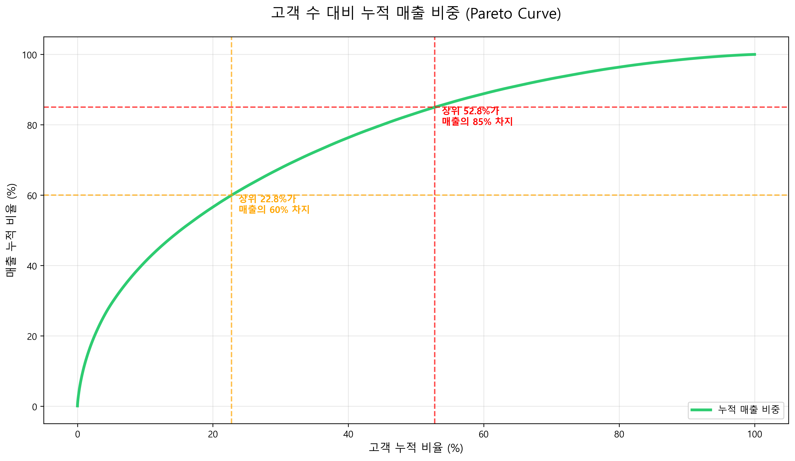
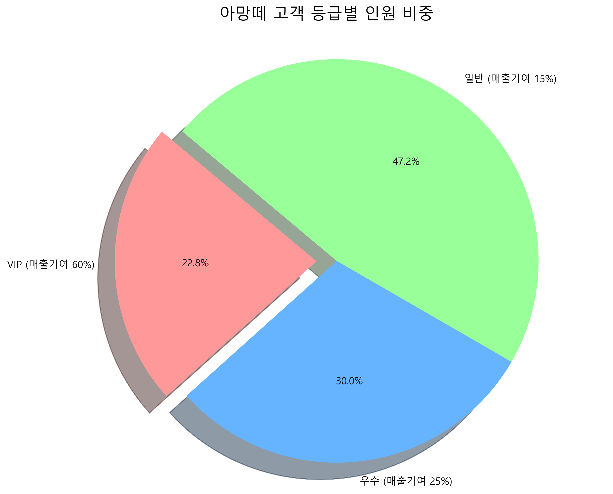
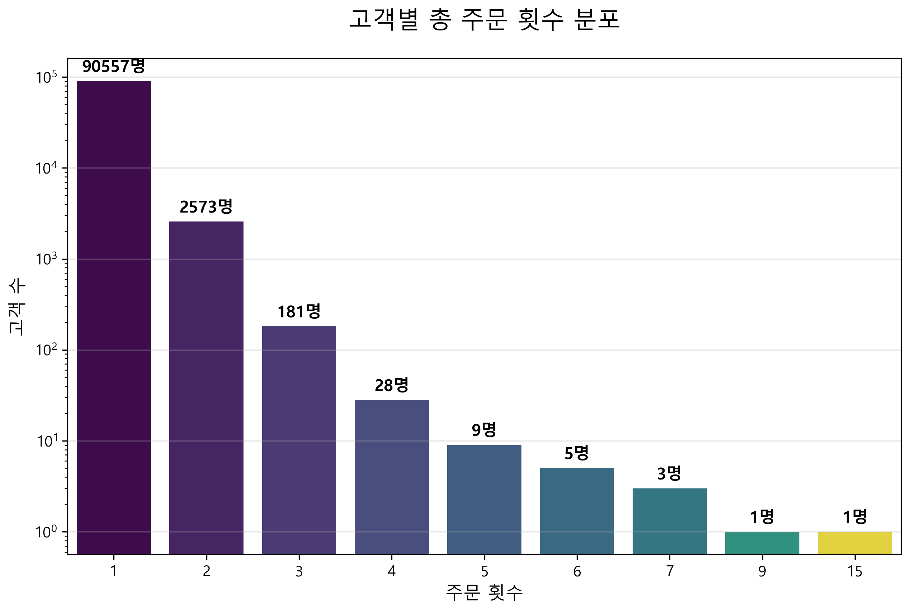

# 📊 Data Analyst Portfolio - 김기창

> **사용자 행동 데이터를 기반으로 비즈니스 인사이트를 도출하고 데이터 기반 의사결정을 수행한 분석 포트폴리오입니다.**

---

## 🚀 Project 1. 아망떼(Amante) 고객 세분화 및 CRM 전략 수립

 

### 1️⃣ 개요 (Overview)
* **배경**: 브랜드 성장을 위해 핵심 고객을 정의하고, 한정된 마케팅 자원을 집중할 타겟팅 전략 필요
* **목표**: 파레토 분석을 통한 VIP 고객 식별 및 재구매 유도를 위한 CRM 액션 플랜 수립

### 2️⃣ 분석 워크플로우 (Workflow)
* **EDA**: 11만 건의 주문 데이터 정제 및 배송 완료(delivered) 건 필터링
* **Customer Segmentation**: 누적 매출 기여도 기반 고객 등급 분류 (VIP/우수/일반)
* **Insight**: 상위 **13% 고객이 전체 매출의 60%를 견인**하는 매출 쏠림 현상 확인

### 3️⃣ 시각화 및 전략 제안
| 분석 결과 (Visual) | 전략 제안 (Action Plan) |
| :---: | :--- |
|  | **VIP 락인**: 상위 5.2% 핵심 고객 대상 전용 혜택 제공 및 리워드 강화 |
|  | **타겟 마케팅**: 우수 고객 대상 재구매 유도 쿠폰 및 리텐션 캠페인 |
|  | **CRM 자동화**: 침구 교체 주기(6개월)에 맞춘 개인화 리마인드 알림톡 |

---

## 📉 Project 2. 사용자 이탈 예측 분석 (Churn Prediction)

 

### 1️⃣ 분석 내용
* 사용자 거래 및 활동성 데이터를 활용하여 이탈 징후를 사전에 포착하는 예측 모델 구축
* **적용 모델**: Logistic Regression, XGBoost, Stacking Ensemble 적용

### 2️⃣ 핵심 인사이트 (Key Insights)
* **이탈 신호**: 최근 거래 빈도 및 구매 금액 감소가 가장 강력한 이탈 전조 증상임을 파악
* **성과**: 이탈 고객 **Recall 0.9+ 달성**으로 고위험 고객군에 대한 선제적 대응 기반 마련

### 3️⃣ 기술 스택 (Tech Stack)
* **Language**: Python
* **Library**: Pandas, Scikit-learn, XGBoost
* **Database**: SQL

---

## 🛠 Workflow & Methodology
예시 이미지의 분석 프로세스를 준수하여 모든 프로젝트를 수행합니다.
`문제 인식` → `EDA` → `데이터 전처리` → `모델링/분석` → `전략 제안` → `기대 효과 산출`

---
**GitHub:** [github.com/Ponolia](https://github.com/Ponolia)
