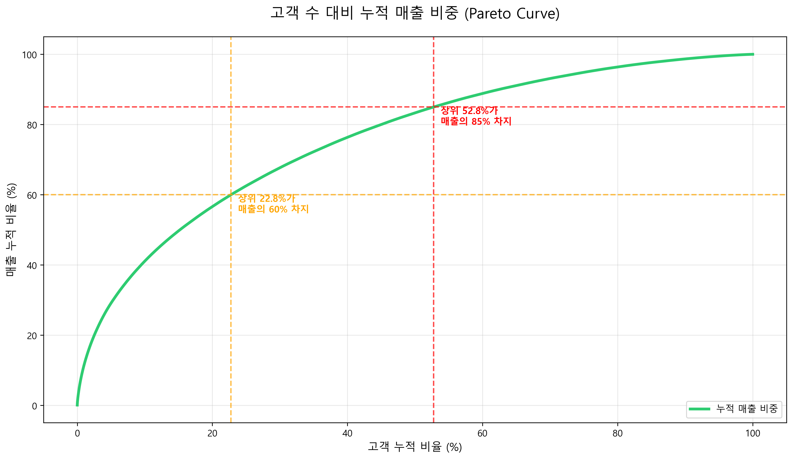
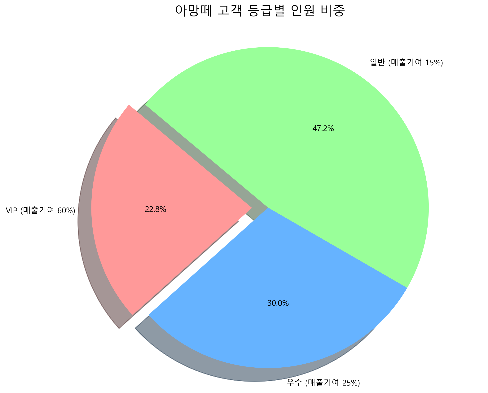
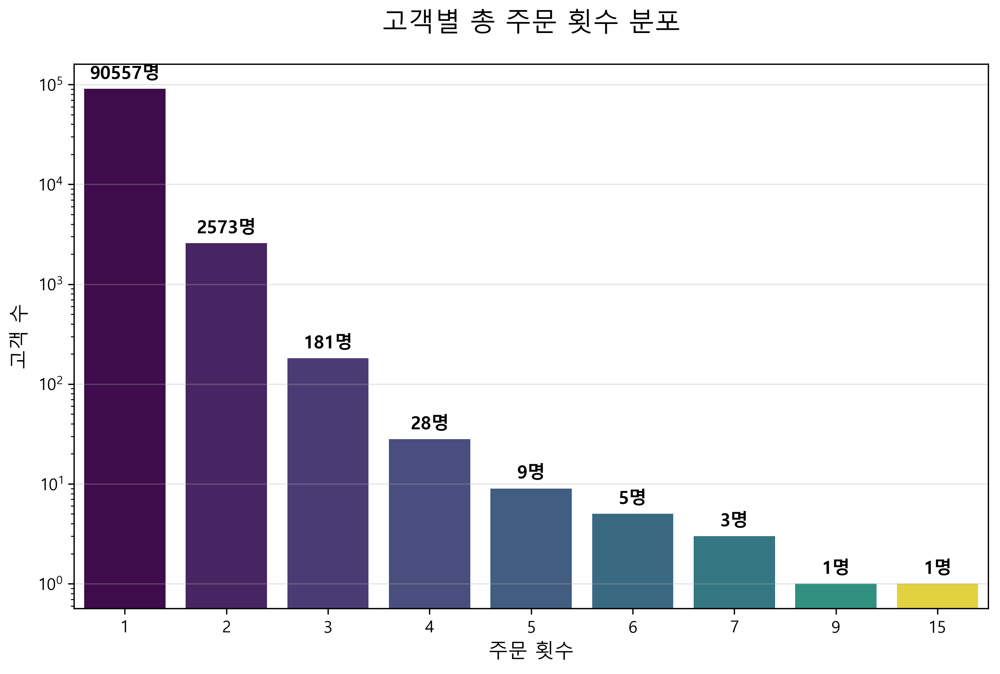

# 📊 Data Analyst Portfolio - 김기창

> **사용자 행동 데이터를 기반으로 비즈니스 인사이트를 도출하고 데이터 기반 의사결정을 수행한 분석 포트폴리오입니다.**

---

## 🚀 Project 1. E-commerce고객 세분화 및 CRM 전략 수립

 

### 1️⃣ 개요 (Overview)
* **배경**: 브랜드 성장을 위해 핵심 고객을 정의하고, 한정된 마케팅 자원을 집중할 타겟팅 전략 필요
* **목표**: 파레토 분석을 통한 VIP 고객 식별 및 재구매 유도를 위한 CRM 액션 플랜 수립

### 2️⃣ 분석 워크플로우 (Workflow)
* **EDA**: 11만 건의 주문 데이터 정제 및 배송 완료(delivered) 건 필터링
* **Customer Segmentation**: 누적 매출 기여도 기반 고객 등급 분류 (VIP/우수/일반)
* **Insight**: 상위 **13% 고객이 전체 매출의 60%를 견인**하는 매출 쏠림 현상 확인

### 3️⃣ 시각화 및 전략 제안
| 분석 결과 (Visual) | 전략 제안 (Action Plan) |
| :---: | :--- |
|  | **VIP 락인**: 상위 5.2% 핵심 고객 대상 전용 혜택 제공 및 리워드 강화 |
|  | **타겟 마케팅**: 우수 고객 대상 재구매 유도 쿠폰 및 리텐션 캠페인 |
|  | **CRM 자동화**: 교체 주기(6개월)에 맞춘 개인화 리마인드 알림톡 |

---

## 📉 Project 2. 카드 고객 이탈 예측 및 위험 등급 관리 (Churn Prediction)

 

## **Executive Summary**

카드 고객 이탈은 매출 감소로 직결되는 핵심 문제입니다.
본 프로젝트에서는 이탈 예측 모델과 거래 활동성 지표를 결합하여,
실무에서 즉시 활용 가능한 3단계 고객 위험 관리 체계를 구축했습니다.

분석 결과, 이탈 고객은 거래 활동성 감소라는 명확한 선행 패턴을 보였으며,
이를 기반으로 이탈 고객의 약 92%를 사전에 탐지(Recall 기준)할 수 있었습니다.

또한 본 분석은 Precision보다 Recall을 우선 최적화하여
이탈 가능 고객을 최대한 놓치지 않는 방향으로 설계되었습니다.

**제안**
고위험 고객 대상 즉각적인 리텐션 캠페인 실행
중위험 고객 사전 관리 전략 도입
데이터 기반 고객 관리 자동화 체계 구축

### 1️⃣ 분석 요약
이탈 고객은 단순 확률 예측만으로는 식별에 한계가 있어,
거래 활동성 지표와 결합한 행동 기반 위험도 정의를 적용했습니다.

분석 결과,
거래 횟수 감소
거래 금액 감소
거래 변화율 감소
비활성 기간 증가

가 주요 이탈 선행 지표로 확인되었습니다.

특히 이탈 고객은
위 지표 중 2개 이상이 악화되는 경향을 보였습니다.
이를 기반으로 실무 적용 가능한 3단계 위험 관리 체계를 설계했습니다.

### 2️⃣ 위험 등급 분류 체계 (Risk Segmentation)
| 등급 | 정의 및 기준 | 관리 전략 (Action Plan) |
| :--- | :--- | :--- |
| **🚨 High Risk** | 이탈 확률 ≥ 0.7 | 즉각적인 복귀 프로모션 및 전담 케어 |
| **⚠️ Medium Risk** | 0.4 ≤ 이탈 확률 < 0.7 | 서비스 재방문 유도를 위한 맞춤형 알림 |
| **✅ Low Risk** | 이탈 확률 < 0.4 | 로열티 강화 및 교차 판매(Cross-selling) |
기준 설명:모델 학습 단계에서는 Recall 확보를 위해 threshold를 낮춰 실험
실제 운영에서는 마케팅 자원 효율성과 과도한 타겟팅 방지를 위해 보수적인 기준(0.7 / 0.4) 적용

기대 효과: 고위험 고객 선제 대응, 고객 이탈률 감소,마케팅 비용 효율화

### 3️⃣ 실무 적용을 위한 데이터 추출 로직

모델 예측 결과를 DB에 반영하여
마케팅팀이 이탈 위험 고객을 실시간으로 추출할 수 있도록
확률 기반 + 행동 지표 기반 복합 조건 SQL 로직을 설계했습니다.

### 4️⃣ 기술 스택 및 성과
Model: XGBoost (최종 선정), Random Forest 비교
전략: Threshold 조정 + 클래스 가중치 적용
성과: 이탈 고객 Recall 92% 달성, 이탈 고객 대부분 사전 탐지 가능

최종 모델
Weighted XGBoost 모델 선정
(이탈 최소화 목적에 가장 적합)

### 5️⃣ 실무 적용 방안

모델 예측 결과를 DB에 반영하여
마케팅 및 CRM 시스템에서 실시간으로 위험 고객 추출 가능하도록 설계

#### 적용 방식
확률 기반 Risk Segmentation 자동 분류
SQL 기반 타겟 고객 추출 로직 설계
CRM 시스템 연동 가능

기대 효과 

고위험 고객 선제 대응
고객 이탈률 감소
마케팅 비용 효율화

---
## 🛠 문제 해결 프로세스
`문제 정의 → EDA → 데이터 전처리 → 모델링 → 성능 개선 → 전략 설계 → 실무 적용 방안 도출`

---
**GitHub:** [github.com/Ponolia](https://github.com/Ponolia)
